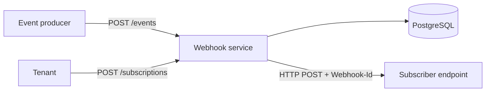

# Webhook Delivery Service

A webhook delivery platform built with Java 21 and Spring Boot. Tenants register endpoints for the event types they care about; when an event happens, the service fans it out to every matching endpoint, delivers it over HTTP and keeps a full audit trail of every attempt.

## What problem does it solve?

Imagine a marketplace seller who runs a stock system and an accounting system outside the marketplace. When a customer places an order, both systems need to know about it right away. Instead of polling the marketplace every few minutes, they register a URL once and the marketplace **pushes** the event to them.

This service is that "push" layer:

1. A tenant subscribes: *"Send `order.created` events to `https://my-stock-app.com/hook`."*
2. The marketplace reports an event: *"Order 12345 was created for this tenant."*
3. The service finds every matching subscription, creates one delivery per subscription and sends it.
4. Every attempt is logged: when it happened, how long it took, what the receiver answered.

## Status

| Phase | Scope | Status |
|---|---|---|
| 1.1 | Domain model, REST API, PostgreSQL + Flyway, validation, error handling, synchronous delivery | ✅ Done |
| 1.2 | Idempotency: rejecting duplicate requests | ⏳ Next |
| 1.3 | Asynchronous delivery with the outbox pattern and a background worker | |
| 1.4 | Retries with exponential backoff + jitter, dead letter | |
| 1.5 | HMAC signatures, timeouts, circuit breaker | |
| 1.6 | Moving the worker to Kafka | |
| 1.7 | Testcontainers, observability, load test | |

## Architecture (current)



## Data model

| Table | Holds | Example |
|---|---|---|
| `subscriptions` | Who wants which event types, at which URL | *Tenant `acme` wants `order.created` at `https://.../hook`* |
| `events` | Every event reported to the system, with its JSON payload | *Order 12345 was created* |
| `deliveries` | One row per (event, subscription) pair and its current state | *Order 12345 → stock app: `SUCCEEDED`* |
| `delivery_attempts` | One row per HTTP attempt: time, duration, status code, error | *Attempt 1: HTTP 500 after 175 ms* |

Delivery states: `PENDING` → `SUCCEEDED` / `FAILED` (→ `DEAD` in a later phase).

The schema is owned by Flyway migrations (`src/main/resources/db/migration`). Hibernate only validates it (`ddl-auto: validate`).

## API

| Method | Path | Description | Success |
|---|---|---|---|
| `POST` | `/subscriptions` | Register an endpoint for one or more event types | `201` + `Location` |
| `GET` | `/subscriptions/{id}` | Read a subscription (the secret is never returned) | `200` |
| `POST` | `/events` | Report an event; deliveries are created for every matching subscription | `202` |
| `GET` | `/deliveries?eventId=...` | List the deliveries of an event and their states | `200` |

Errors follow [RFC 9457 Problem Details](https://www.rfc-editor.org/rfc/rfc9457). Validation errors include a per-field `errors` list.

### Example

```bash
# 1. Subscribe
curl -i -X POST http://localhost:8080/subscriptions \
  -H "Content-Type: application/json" \
  -d '{"tenantId":"acme","url":"https://httpbin.org/post","secret":"super-secret-key-123","eventTypes":["order.created"]}'

# 2. Report an event
curl -i -X POST http://localhost:8080/events \
  -H "Content-Type: application/json" \
  -d '{"tenantId":"acme","eventType":"order.created","payload":{"orderId":12345}}'

# 3. Check its deliveries (use the id returned in step 2)
curl -i "http://localhost:8080/deliveries?eventId=<EVENT_ID>"
```

Every webhook is sent with these headers:

| Header | Value |
|---|---|
| `Content-Type` | `application/json` |
| `Webhook-Id` | The delivery id. Identical across all attempts of the same delivery, so receivers can drop duplicates. |
| `Webhook-Event` | The event type, e.g. `order.created` |

## Running locally

Requirements: Java 21, Docker.

```bash
docker compose up -d        # PostgreSQL 17 on localhost:5433
./mvnw spring-boot:run      # app on localhost:8080, Flyway migrates on startup
```

Health check: `GET http://localhost:8080/actuator/health`

## Design decisions

<!--
  BU BÖLÜMÜ SEN YAZACAKSIN.
  Her başlığın altına 2-4 cümle. Kendi kelimelerinle, mülakatta nasıl anlatacaksan öyle.
  Türkçe yazıp sonra birlikte İngilizceye çevirebiliriz.
  Her başlıktaki yorum satırı sana ne yazman gerektiğini hatırlatıyor; bitince yorumları sil.
-->

### Why separate `events`, `deliveries` and `delivery_attempts` tables?

<!-- Bir olay birden fazla aboneye gidiyor ve her birinin sonucu farklı olabiliyor. Sayaç yerine deneme tablosu tutmak neyi kazandırıyor? (Ayşe "neden gelmedi?" diye sorunca ne gösteriyorsun?) -->

### Why UUIDs for deliveries but `bigint` for attempts?

<!-- Karar kriteri: ID dışarı çıkıyor mu? Delivery ID'si nerelerde görünüyor, attempt ID'si nerede? -->

### Delivery guarantee: at-least-once, not exactly-once

<!-- Timeout aldığında karşı taraf mesajı aldı mı bilemezsin. Bu yüzden ne seçtin? Webhook-Id neden her denemede aynı? -->

### Why `202 Accepted` for events but `201 Created` for subscriptions?

<!-- İş bitti mi, bitmedi mi? -->

### Fixing an N+1 query on the delivery list

<!-- SQL logunda ne gördün (kaç sorgu)? Sebebi neydi (LAZY)? Neyle çözdün, sonuç ne oldu? Alternatifler neydi? -->

## Known limitations (to be addressed in the next phases)

- **Delivery happens synchronously, inside the database transaction.** `POST /events` waits for every subscriber to answer; ten slow subscribers with a 5 s timeout would block the request for ~50 s and hold a DB connection the whole time. Worse, an HTTP call cannot be rolled back: if the transaction fails after one webhook was already sent, the receiver has processed an event that no longer exists on our side. → Phase 1.3 (outbox pattern).
- **Failed deliveries are never retried.** `next_attempt_at` is not yet scheduled after a failure. → Phase 1.4.
- **Duplicate requests create duplicate records.** Sending the same subscription or event twice creates two rows, so receivers get the same notification twice. → Phase 1.2.
- **Webhooks are not signed yet.** Receivers cannot verify that a request really came from this service. → Phase 1.5.