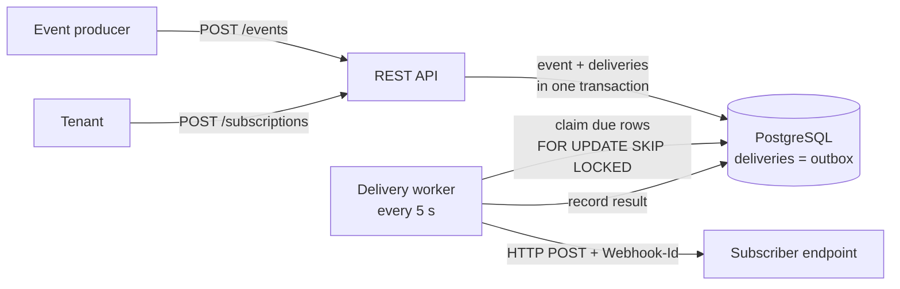
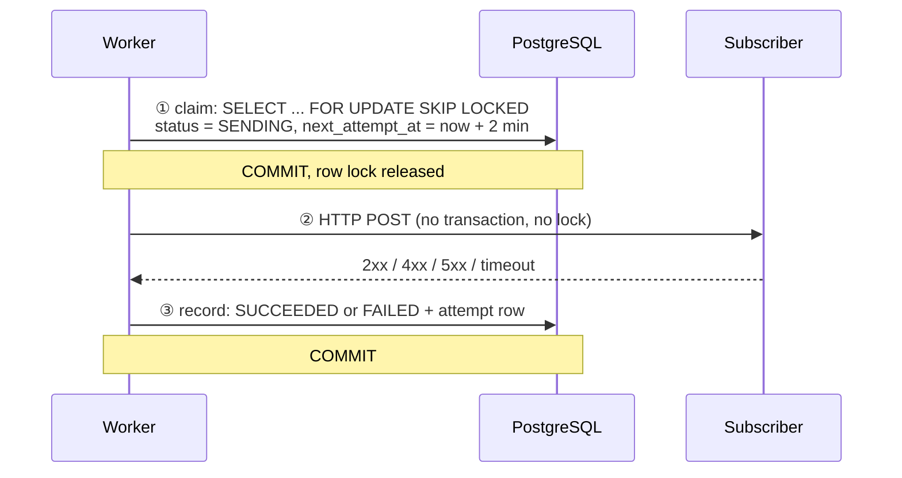
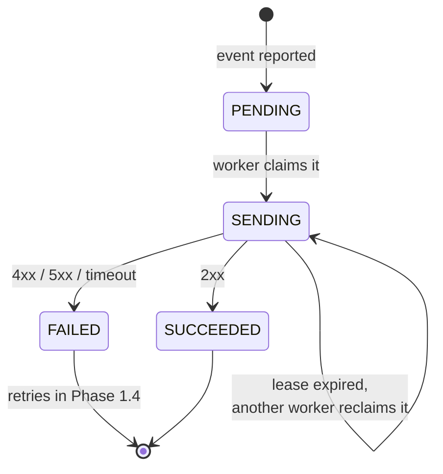

# Webhook Delivery Service

A webhook delivery platform built with Java 21 and Spring Boot. Tenants register endpoints for the event types they care about; when an event happens, the service fans it out to every matching endpoint, delivers it over HTTP in the background and keeps a full audit trail of every attempt.

## What problem does it solve?

Imagine a marketplace seller who runs a stock system and an accounting system outside the marketplace. When a customer places an order, both systems need to know about it right away. Instead of polling the marketplace every few minutes, they register a URL once and the marketplace **pushes** the event to them.

This service is that "push" layer:

1. A tenant subscribes: *"Send `order.created` events to `https://my-stock-app.com/hook`."*
2. The marketplace reports an event: *"Order 12345 was created for this tenant."*
3. The service finds every matching subscription and stores one delivery per subscription, then answers immediately.
4. A background worker picks up pending deliveries and sends them.
5. Every attempt is logged: when it happened, how long it took, what the receiver answered.

## Status

| Phase | Scope | Status |
|---|---|---|
| 1.1 | Domain model, REST API, PostgreSQL + Flyway, validation, error handling, synchronous delivery | ✅ Done |
| 1.2 | Idempotency: rejecting duplicate requests | ✅ Done |
| 1.3 | Asynchronous delivery with the outbox pattern and a background worker | ✅ Done |
| 1.4 | Retries with exponential backoff + jitter, dead letter | ⏳ Next |
| 1.5 | HMAC signatures, timeouts, circuit breaker | |
| 1.6 | Moving the worker to Kafka | |
| 1.7 | Testcontainers, observability, load test | |

## Architecture (current)


```mermaid
flowchart LR
    P[Event producer] -->|POST /events| API[REST API]
    T[Tenant] -->|POST /subscriptions| API
    API -->|event + deliveries<br/>in one transaction| DB[(PostgreSQL<br/>deliveries = outbox)]
    W[Delivery worker<br/>every 5 s] -->|claim due rows<br/>FOR UPDATE SKIP LOCKED| DB
    W -->|HTTP POST + Webhook-Id| S[Subscriber endpoint]
    W -->|record result| DB
```

`POST /events` never talks to subscribers. It writes the event and its deliveries in a single transaction and returns `202 Accepted`. Sending is done by a scheduled worker, so a slow or broken subscriber can no longer slow down or break the API.

### How the worker sends a delivery

Each run of the worker handles up to 10 due deliveries in three steps. Only the first and the last step touch the database, and each one is a short transaction of its own:


```mermaid
sequenceDiagram
    participant W as Worker
    participant DB as PostgreSQL
    participant S as Subscriber
    W->>DB: ① claim: SELECT ... FOR UPDATE SKIP LOCKED<br/>status = SENDING, next_attempt_at = now + 2 min
    Note over W,DB: COMMIT, row lock released
    W->>S: ② HTTP POST (no transaction, no lock)
    S-->>W: 2xx / 4xx / 5xx / timeout
    W->>DB: ③ record: SUCCEEDED or FAILED + attempt row
    Note over W,DB: COMMIT
```

Several instances of the service can run side by side: `SKIP LOCKED` makes each worker skip rows another worker is claiming, and the `SENDING` status keeps claimed rows out of everyone else's query after the lock is released.

## Data model

| Table | Holds | Example |
|---|---|---|
| `subscriptions` | Who wants which event types, at which URL | *Tenant `acme` wants `order.created` at `https://.../hook`* |
| `events` | Every event reported to the system, with its JSON payload | *Order 12345 was created* |
| `deliveries` | One row per (event, subscription) pair, its current state and when it is due. Also serves as the outbox. | *Order 12345 → stock app: `SUCCEEDED`* |
| `delivery_attempts` | One row per HTTP attempt: time, duration, status code, error | *Attempt 1: HTTP 500 after 175 ms* |

### Delivery states


```mermaid
stateDiagram-v2
    [*] --> PENDING: event reported
    PENDING --> SENDING: worker claims it
    SENDING --> SUCCEEDED: 2xx
    SENDING --> FAILED: 4xx / 5xx / timeout
    SENDING --> SENDING: lease expired,<br/>another worker reclaims it
    FAILED --> [*]: retries in Phase 1.4
    SUCCEEDED --> [*]
```

`next_attempt_at` means "when the worker should look at this row next":

| State | `next_attempt_at` |
|---|---|
| `PENDING` | Creation time: due immediately |
| `SENDING` | End of the 2-minute lease. If the worker dies before recording a result, the row becomes due again after that. |
| `SUCCEEDED` | `NULL`: there is no next attempt |
| `FAILED` | Unchanged for now; will hold the next retry time in Phase 1.4 |

The schema is owned by Flyway migrations (`src/main/resources/db/migration`). Hibernate only validates it (`ddl-auto: validate`).

## API

| Method | Path | Description | Success |
|---|---|---|---|
| `POST` | `/subscriptions` | Register an endpoint for one or more event types | `201` + `Location` |
| `GET` | `/subscriptions/{id}` | Read a subscription (the secret is never returned) | `200` |
| `POST` | `/events` | Report an event. Deliveries are stored for every matching subscription and sent asynchronously by the worker. Requires an `Idempotency-Key` header. | `202` |
| `GET` | `/deliveries?eventId=...` | List the deliveries of an event and their states | `200` |

Errors follow [RFC 9457 Problem Details](https://www.rfc-editor.org/rfc/rfc9457). Validation errors include a per-field `errors` list.

### Idempotent event reporting

`POST /events` requires an `Idempotency-Key` header (for example a UUID generated by the caller). Keys are scoped per tenant.

| Situation | Response |
|---|---|
| New key | The event is stored and `202` is returned. |
| Key already used, first request finished | The original response is returned again (`202`); no new event or deliveries are created. |
| Key already used, first request still in progress | `409 Conflict`. The caller should retry later with the same key and the same body. |

### Example

```bash
# 1. Subscribe
curl -i -X POST http://localhost:8080/subscriptions \
  -H "Content-Type: application/json" \
  -d '{"tenantId":"acme","url":"https://httpbin.org/post","secret":"super-secret-key-123","eventTypes":["order.created"]}'

# 2. Report an event (returns immediately with 202)
curl -i -X POST http://localhost:8080/events \
  -H "Content-Type: application/json" \
  -H "Idempotency-Key: 7f1c2b9e-order-12345" \
  -d '{"tenantId":"acme","eventType":"order.created","payload":{"orderId":12345}}'

# 3. Check its deliveries a few seconds later (use the id returned in step 2)
curl -i "http://localhost:8080/deliveries?eventId=<EVENT_ID>"
```

Every webhook is sent with these headers:

| Header | Value |
|---|---|
| `Content-Type` | `application/json` |
| `Webhook-Id` | The delivery id. Identical across all attempts of the same delivery, so receivers can drop duplicates. |
| `Webhook-Event` | The event type, e.g. `order.created` |

## Running locally

Requirements: Java 21, Docker.

```bash
docker compose up -d        # PostgreSQL 17 on localhost:5433
./mvnw spring-boot:run      # app on localhost:8080, Flyway migrates on startup
```

Health check: `GET http://localhost:8080/actuator/health`

To see several workers sharing the same queue, start a second instance on another port:

```bash
./mvnw spring-boot:run -Dspring-boot.run.arguments=--server.port=8081
```

## Design decisions

<!--
  BU BÖLÜMÜ SEN YAZACAKSIN.
  Her başlığın altına 2-4 cümle. Kendi kelimelerinle, mülakatta nasıl anlatacaksan öyle.
  Türkçe yazıp sonra birlikte İngilizceye çevirebiliriz.
  Her başlıktaki yorum satırı sana ne yazman gerektiğini hatırlatıyor; bitince yorumları sil.
-->

### Why separate `events`, `deliveries` and `delivery_attempts` tables?

<!-- Bir olay birden fazla aboneye gidiyor ve her birinin sonucu farklı olabiliyor. Sayaç yerine deneme tablosu tutmak neyi kazandırıyor? (Ayşe "neden gelmedi?" diye sorunca ne gösteriyorsun?) -->

### Why UUIDs for deliveries but `bigint` for attempts?

<!-- Karar kriteri: ID dışarı çıkıyor mu? Delivery ID'si nerelerde görünüyor, attempt ID'si nerede? -->

### Delivery guarantee: at-least-once, not exactly-once

<!-- Timeout aldığında karşı taraf mesajı aldı mı bilemezsin. Bu yüzden ne seçtin? Webhook-Id neden her denemede aynı? -->

### Why `202 Accepted` for events but `201 Created` for subscriptions?

<!-- İş bitti mi, bitmedi mi? (Artık 202 daha da anlamlı: teslimat gerçekten sonra yapılıyor.) -->

### Fixing an N+1 query on the delivery list

<!-- SQL logunda ne gördün (kaç sorgu)? Sebebi neydi (LAZY)? Neyle çözdün, sonuç ne oldu? Alternatifler neydi? -->

### Idempotency: an application check plus a unique constraint

<!-- Kodda "bu anahtar var mı?" kontrolü neden tek başına yetmedi? (İki Postman sekmesi deneyi: ikisi de aynı anda "yok" cevabı aldı)
     Constraint patlayınca neden 500 değil 409 dönüyoruz? Müşteri ne yapmalı? (Aynı anahtar + aynı body ile tekrar dene) -->

### Outbox: using the `deliveries` table instead of a separate outbox table

<!-- Neden HTTP çağrısı DB transaction'ı içinde yapılmamalı? (Geri alınamayan HTTP: Ayşe'nin stoğu düştü ama bizde olay yok)
     Neden ayrı bir outbox tablosu açmadın? (Teslimat satırları olayla aynı transaction'da yazılıyor → zaten outbox) -->

### `FOR UPDATE SKIP LOCKED`: several workers, no double sends

<!-- İki instance deneyinde ne gördün? (2 ms fark, aynı teslimat iki kez gitti, unique constraint sadece kaydı engelledi)
     FOR UPDATE ne yapıyor, SKIP LOCKED ne ekliyor? (Çift gönderimi engellemek vs. birbirini beklememek) -->

### Short transactions: claim → send → record

<!-- Kilidi HTTP süresince tutmak neden kötü? (/delay/4 deneyi: bağlantı ve kilit 4 sn meşgul)
     Kilit kalkınca diğer worker'ı ne durduruyor? (SENDING durumu)
     Neden claimDue/recordResult ayrı bir sınıfta ve poll() neden @Transactional değil? (Self-invocation, dış transaction'a katılma) -->

### Lease: recovering deliveries stuck in `SENDING`

<!-- Worker HTTP sırasında çökerse ne olur? next_attempt_at'i neden lease bitişi olarak kullandın?
     Neden 2 dakika? (Batch 10 × en kötü 7 sn = 70 sn; tek isteğin timeout'u değil, batch'in toplamı) -->

## Known limitations (to be addressed in the next phases)

- **Failed deliveries are never retried.** A failed delivery stays `FAILED`; `next_attempt_at` is not yet set to a retry time. → Phase 1.4 (exponential backoff + dead letter).
- **One broken delivery stops the rest of the batch.** If recording the result of one delivery throws, the worker stops that run and the remaining claimed deliveries wait in `SENDING` until their lease expires. Each delivery should be handled in its own `try/catch`. → Phase 1.4.
- **A delivery can be sent twice after a lease expires.** If a send takes longer than the 2-minute lease, another worker may reclaim and resend it; the late result is then recorded as an extra attempt. This is accepted under at-least-once delivery (receivers deduplicate by `Webhook-Id`); a fencing token on the claim would prevent the stale write.
- **N+1 when claiming.** The claim query is native (it needs `FOR UPDATE SKIP LOCKED`), so `@EntityGraph` cannot be used and each claimed delivery loads its subscription separately. Bounded by the batch size of 10; `hibernate.default_batch_fetch_size` would fold these into one `IN (...)` query.
- **Up to 5 seconds of delivery latency.** The worker polls on a fixed delay instead of being notified of new rows. → Phase 1.6 (Kafka).
- **Duplicate subscriptions are still possible.** Events are protected by the `Idempotency-Key` header, but creating the same subscription twice still creates two rows, so the receiver gets every notification twice.
- **A reused key with a different body is not detected.** The stored response is returned without comparing request bodies; this should become `422 Unprocessable Entity`.
- **Webhooks are not signed yet.** Receivers cannot verify that a request really came from this service. → Phase 1.5.