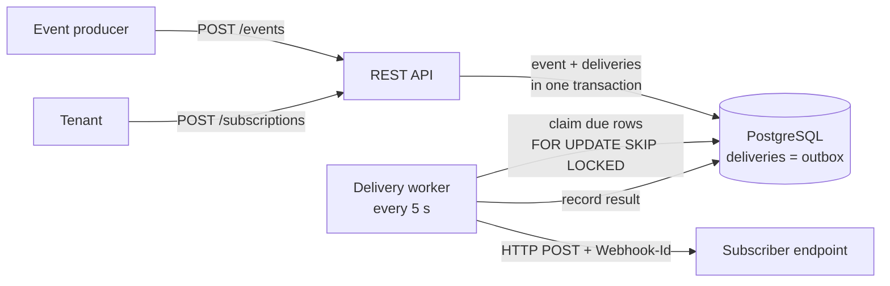
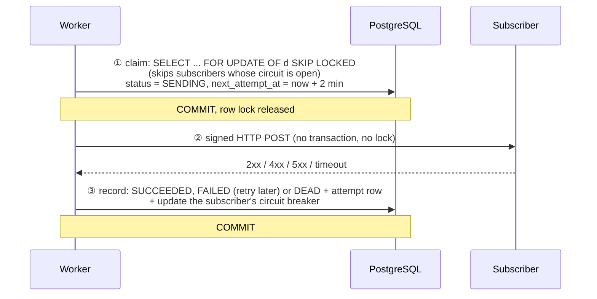
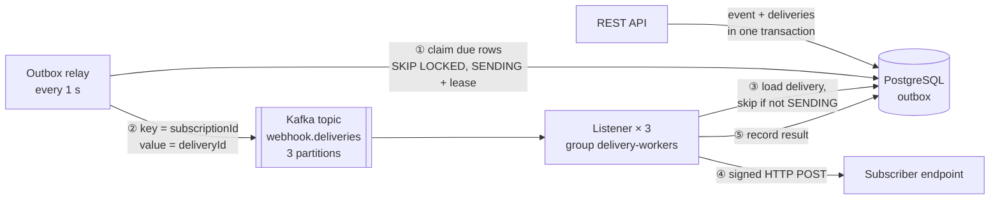
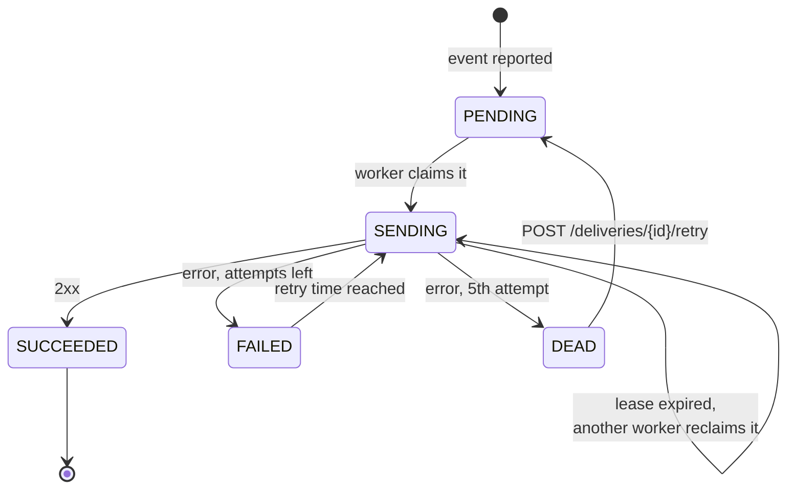
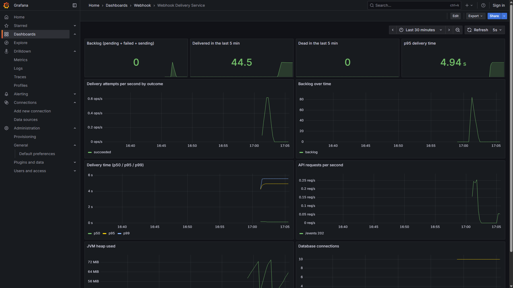

# Webhook Delivery Service

[](https://github.com/BayramSevim/webhook/actions/workflows/ci.yml)

A webhook delivery platform built with Java 21 and Spring Boot. Tenants register endpoints for the event types they care about; when an event happens, the service fans it out to every matching endpoint, delivers it over HTTP in the background, signs every request and keeps a full audit trail of every attempt.


## Demo
https://github.com/user-attachments/assets/16b8579e-cced-41d1-8e6b-6b28ad8ffdc0

*The shipping partner is down at first: its deliveries fail and are retried with backoff. Once it recovers, every waiting delivery goes out and nothing is lost. The Grafana dashboard follows along. (The small order page in the video is a throwaway UI made only for this recording; it is not part of the repository.)*

## What problem does it solve?

Imagine a marketplace seller who runs a stock system and an accounting system outside the marketplace. When a customer places an order, both systems need to know about it right away. Instead of polling the marketplace every few minutes, they register a URL once and the marketplace **pushes** the event to them.

This service is that "push" layer:

1. A tenant subscribes: *"Send `order.created` events to `https://my-stock-app.com/hook`."*
2. The marketplace reports an event: *"Order 12345 was created for this tenant."*
3. The service finds every matching subscription and stores one delivery per subscription, then answers immediately.
4. A background worker picks up pending deliveries and sends them. Failed deliveries are retried with growing delays; after 5 failed attempts a delivery is marked `DEAD` and can be retried by hand.
5. Every attempt is logged: when it happened, how long it took, what the receiver answered.

## Status

| Phase | Scope | Status |
|---|---|---|
| 1.1 | Domain model, REST API, PostgreSQL + Flyway, validation, error handling, synchronous delivery | ✅ Done |
| 1.2 | Idempotency: rejecting duplicate requests | ✅ Done |
| 1.3 | Asynchronous delivery with the outbox pattern and a background worker | ✅ Done |
| 1.4 | Retries with exponential backoff + jitter, dead letter, manual retry | ✅ Done |
| 1.5 | HMAC signatures, per-subscriber circuit breaker | ✅ Done |
| 1.6 | Kafka dispatch mode: outbox relay, idempotent consumer, switchable by config | ✅ Done |
| 1.7 | Multi-stage Docker image, one-command `docker compose` setup, unit + Testcontainers tests, GitHub Actions CI, graceful shutdown | ✅ Done |
| 1.8 | Metrics with Micrometer, Prometheus and a provisioned Grafana dashboard | ✅ Done |
| Next | Load test (database vs Kafka mode) | Planned |

## Architecture (current)


```mermaid
flowchart LR
    P[Event producer] -->|POST /events| API[REST API]
    T[Tenant] -->|POST /subscriptions| API
    API -->|event + deliveries<br/>in one transaction| DB[(PostgreSQL<br/>deliveries = outbox)]
    W[Delivery worker<br/>every 5 s] -->|claim due rows<br/>FOR UPDATE SKIP LOCKED| DB
    W -->|HTTP POST + Webhook-Id| S[Subscriber endpoint]
    W -->|record result| DB
```

`POST /events` never talks to subscribers. It writes the event and its deliveries in a single transaction and returns `202 Accepted`. Sending is done by a scheduled worker, so a slow or broken subscriber can no longer slow down or break the API.

### How the worker sends a delivery

Each run of the worker handles up to 10 due deliveries in three steps. Only the first and the last step touch the database, and each one is a short transaction of its own:


```mermaid
sequenceDiagram
    participant W as Worker
    participant DB as PostgreSQL
    participant S as Subscriber
    W->>DB: ① claim: SELECT ... FOR UPDATE OF d SKIP LOCKED<br/>(skips subscribers whose circuit is open)<br/>status = SENDING, next_attempt_at = now + 2 min
    Note over W,DB: COMMIT, row lock released
    W->>S: ② signed HTTP POST (no transaction, no lock)
    S-->>W: 2xx / 4xx / 5xx / timeout
    W->>DB: ③ record: SUCCEEDED, FAILED (retry later) or DEAD + attempt row<br/>+ update the subscriber's circuit breaker
    Note over W,DB: COMMIT
```

Several instances of the service can run side by side: `SKIP LOCKED` makes each worker skip rows another worker is claiming, and the `SENDING` status keeps claimed rows out of everyone else's query after the lock is released.

### Dispatch modes: database polling or Kafka

How deliveries reach the sender is chosen with one setting, `webhook.dispatch` (`db` by default, or `kafka`). The API, the database and the sending logic are the same in both modes; only the trigger changes.

| Mode | Who finds due deliveries | Who sends them |
|---|---|---|
| `db` | `DeliveryWorker`, every 5 s | the same worker, one after another |
| `kafka` | `OutboxRelay`, every 1 s, publishes them to Kafka | `KafkaDeliveryListener`, 3 consumers in the `delivery-workers` group |


```mermaid
flowchart LR
    API[REST API] -->|event + deliveries<br/>in one transaction| DB[(PostgreSQL<br/>outbox)]
    R[Outbox relay<br/>every 1 s] -->|① claim due rows<br/>SKIP LOCKED, SENDING + lease| DB
    R -->|② key = subscriptionId<br/>value = deliveryId| K[[Kafka topic<br/>webhook.deliveries<br/>3 partitions]]
    K --> L[Listener × 3<br/>group delivery-workers]
    L -->|③ load delivery,<br/>skip if not SENDING| DB
    L -->|④ signed HTTP POST| S[Subscriber endpoint]
    L -->|⑤ record result| DB
```

In both modes a single `DeliveryProcessor` does the actual work for one delivery: send it, then record the result.

## Data model

| Table | Holds | Example |
|---|---|---|
| `subscriptions` | Who wants which event types, at which URL, with which signing secret; also the subscriber's circuit breaker state | *Tenant `acme` wants `order.created` at `https://.../hook`* |
| `events` | Every event reported to the system, with its JSON payload | *Order 12345 was created* |
| `deliveries` | One row per (event, subscription) pair, its current state and when it is due. Also serves as the outbox. | *Order 12345 → stock app: `SUCCEEDED`* |
| `delivery_attempts` | One row per HTTP attempt: time, duration, status code, error | *Attempt 1: HTTP 500 after 175 ms* |

### Delivery states


```mermaid
stateDiagram-v2
    [*] --> PENDING: event reported
    PENDING --> SENDING: worker claims it
    SENDING --> SUCCEEDED: 2xx
    SENDING --> FAILED: error, attempts left
    SENDING --> DEAD: error, 5th attempt
    SENDING --> SENDING: lease expired,<br/>another worker reclaims it
    FAILED --> SENDING: retry time reached
    DEAD --> PENDING: POST /deliveries/{id}/retry
    SUCCEEDED --> [*]
```

`next_attempt_at` means "when the worker should look at this row next":

| State | `next_attempt_at` |
|---|---|
| `PENDING` | Creation time: due immediately |
| `SENDING` | End of the 2-minute lease. If the worker dies before recording a result, the row becomes due again after that. |
| `SUCCEEDED` | `NULL`: there is no next attempt |
| `FAILED` | Time of the next retry (see the retry schedule below) |
| `DEAD` | `NULL`: automatic retries are over |

### Retry schedule

A failed delivery is retried with exponential backoff: 10 s × 2^(attempt − 1), multiplied by a random factor between 0.8 and 1.2 (jitter). After the 5th failed attempt the delivery becomes `DEAD`.

| Failed attempt | Next retry after |
|---|---|
| 1 | ~10 s (8–12 s) |
| 2 | ~20 s (16–24 s) |
| 3 | ~40 s (32–48 s) |
| 4 | ~80 s (64–96 s) |
| 5 | `DEAD`, no more automatic retries |

The intervals are kept short so the whole chain can be watched in a few minutes; a production setup would spread them over hours.

### Circuit breaker

Each subscription has its own circuit breaker, stored in the database so that every worker instance sees the same state.

| Column | Meaning |
|---|---|
| `consecutive_failures` | Failed attempts in a row for this subscriber; reset to 0 by any success |
| `circuit_open_until` | `NULL` = closed (normal). Otherwise no delivery to this subscriber is claimed until this time |

After 5 failures in a row the circuit opens for 1 minute. While it is open, the claim query skips that subscriber's deliveries, so no requests are sent and **no retry attempts are used up**. When the minute is over, the next claimed delivery acts as a probe: a success closes the circuit, a failure opens it for another minute.

The schema is owned by Flyway migrations (`src/main/resources/db/migration`). Hibernate only validates it (`ddl-auto: validate`).

## API

| Method | Path | Description | Success |
|---|---|---|---|
| `POST` | `/subscriptions` | Register an endpoint for one or more event types | `201` + `Location` |
| `GET` | `/subscriptions/{id}` | Read a subscription (the secret is never returned) | `200` |
| `POST` | `/events` | Report an event. Deliveries are stored for every matching subscription and sent asynchronously by the worker. Requires an `Idempotency-Key` header. | `202` |
| `GET` | `/deliveries?eventId=...` | List the deliveries of an event and their states | `200` |
| `POST` | `/deliveries/{id}/retry` | Put a `DEAD` delivery back in the queue with a fresh set of 5 attempts. `404` if it does not exist, `409` if it is not `DEAD`. | `202` |

Errors follow [RFC 9457 Problem Details](https://www.rfc-editor.org/rfc/rfc9457). Validation errors include a per-field `errors` list.

### Idempotent event reporting

`POST /events` requires an `Idempotency-Key` header (for example a UUID generated by the caller). Keys are scoped per tenant.

| Situation | Response |
|---|---|
| New key | The event is stored and `202` is returned. |
| Key already used, first request finished | The original response is returned again (`202`); no new event or deliveries are created. |
| Key already used, first request still in progress | `409 Conflict`. The caller should retry later with the same key and the same body. |

### Example

```bash
# 1. Subscribe
curl -i -X POST http://localhost:8080/subscriptions \
  -H "Content-Type: application/json" \
  -d '{"tenantId":"acme","url":"https://httpbin.org/post","secret":"super-secret-key-123","eventTypes":["order.created"]}'

# 2. Report an event (returns immediately with 202)
curl -i -X POST http://localhost:8080/events \
  -H "Content-Type: application/json" \
  -H "Idempotency-Key: 7f1c2b9e-order-12345" \
  -d '{"tenantId":"acme","eventType":"order.created","payload":{"orderId":12345}}'

# 3. Check its deliveries a few seconds later (use the id returned in step 2)
curl -i "http://localhost:8080/deliveries?eventId=<EVENT_ID>"

# 4. If a delivery ended up DEAD (e.g. the receiver was down), send it again once the receiver is fixed
curl -i -X POST "http://localhost:8080/deliveries/<DELIVERY_ID>/retry"
```

Every webhook is sent with these headers:

| Header | Value |
|---|---|
| `Content-Type` | `application/json` |
| `Webhook-Id` | The delivery id. Identical across all attempts of the same delivery, so receivers can drop duplicates. |
| `Webhook-Event` | The event type, e.g. `order.created` |
| `Webhook-Timestamp` | Unix time in seconds when this attempt was sent. New on every attempt. |
| `Webhook-Signature` | `v1,<base64 HMAC-SHA256>`. New on every attempt. |

### Verifying a webhook

Requests are signed following the [Standard Webhooks](https://www.standardwebhooks.com/) layout, using the `secret` given when the subscription was created:

```
signed content = <Webhook-Id> + "." + <Webhook-Timestamp> + "." + <raw request body>
signature      = "v1," + base64( HMAC-SHA256(secret, signed content) )
```

A receiver should:

1. Compute the signature over the **raw** body bytes, before parsing the JSON. Re-serialising the JSON can change whitespace or key order and break the signature (the stored payload is `jsonb`, so it is sent as `{"orderId": 12345}`, with a space).
2. Compare it with `Webhook-Signature` using a constant-time comparison.
3. Reject requests whose `Webhook-Timestamp` is more than a few minutes old, to stop replayed requests.
4. Drop duplicates by `Webhook-Id`.

## Running locally

Requirements: Docker. (Java 21 only if you want to run the app outside Docker.)

**Everything in Docker, one command:**

```bash
docker compose --profile app up -d --build
```

This starts PostgreSQL 17 (`localhost:5433`), Kafka (`localhost:9092`, data kept in a volume), the app (`localhost:8080`, Kafka mode), Prometheus (`localhost:9090`) and Grafana (`localhost:3000`). The app waits until the database and Kafka report healthy. To run the containerised app in database polling mode instead, set `WEBHOOK_DISPATCH=db` in the environment before `docker compose up`.

**For development** (app from the IDE, infrastructure in Docker):

```bash
docker compose up -d        # PostgreSQL + Kafka only
./mvnw spring-boot:run      # app on localhost:8080, database polling mode by default
```

To use Kafka mode from the IDE, set `webhook.dispatch: kafka` in `application.yaml` (or start with `--webhook.dispatch=kafka`). The `webhook.deliveries` topic is created on startup with 3 partitions; automatic topic creation is disabled on the broker.

Health check: `GET http://localhost:8080/actuator/health`

To see several workers sharing the same queue, start a second instance on another port:

```bash
./mvnw spring-boot:run -Dspring-boot.run.arguments=--server.port=8081
```

## Tests

```bash
./mvnw verify               # needs Docker for Testcontainers
```

| Test | What it checks |
|---|---|
| `BackoffPolicyTest` | Give-up rule, doubling delays and jitter (the random tests run 50 times each) |
| `WebhookSignerTest` | A fixed signature computed independently with Python's `hmac`, plus: timestamp, secret and even whitespace in the body change the signature |
| `DeliveryFlowIntegrationTest` | The whole flow against a real PostgreSQL started by **Testcontainers**: subscribe → report an event → worker → HTTP → `SUCCEEDED`. A small in-process HTTP server plays the subscriber and the test verifies the received signature exactly like a receiver would. Also checks idempotent event reporting. |

The integration test never touches the development database: every run gets a fresh, empty PostgreSQL container. (An early version accidentally connected to the local database, where the app running in Docker claimed the test's delivery first and tried to send it to its own `localhost`. That is exactly why tests need their own database.)

Every push runs `./mvnw verify` and builds the Docker image on GitHub Actions.

## Observability

The app exposes metrics at `/actuator/prometheus` (Micrometer). Prometheus scrapes them every 5 seconds, and Grafana starts with the data source and a **Webhook Delivery Service** dashboard already provisioned: open `http://localhost:3000` → Dashboards → Webhook.



Besides the built-in JVM, HTTP and connection pool metrics, three metrics describe the delivery pipeline itself:

| Metric | Type | Meaning |
|---|---|---|
| `webhook_deliveries_total{outcome}` | counter | Recorded attempts by result: `succeeded`, `failed`, `dead` |
| `webhook_delivery_duration_seconds` | timer (histogram) | How long an attempt took, used for the p50 / p95 / p99 panels |
| `webhook_deliveries_backlog` | gauge | Deliveries that are `PENDING`, `FAILED` or `SENDING`, i.e. work the system still owes |

The backlog is the number to alert on: if it keeps growing, deliveries are coming in faster than they go out. It was also the first thing the dashboard showed: with two subscribers taking 4 to 5 seconds each, 100 deliveries drained at well under one per second, the head-of-line blocking described above, visible as a slowly falling backlog line and a p95 of about 5 seconds.

## Design decisions

<!--
  BU BÖLÜMÜ SEN YAZACAKSIN.
  Her başlığın altına 2-4 cümle. Kendi kelimelerinle, mülakatta nasıl anlatacaksan öyle.
  Türkçe yazıp sonra birlikte İngilizceye çevirebiliriz.
  Her başlıktaki yorum satırı sana ne yazman gerektiğini hatırlatıyor; bitince yorumları sil.
-->

### Why separate `events`, `deliveries` and `delivery_attempts` tables?

<!-- Bir olay birden fazla aboneye gidiyor ve her birinin sonucu farklı olabiliyor. Sayaç yerine deneme tablosu tutmak neyi kazandırıyor? (Ayşe "neden gelmedi?" diye sorunca ne gösteriyorsun?) -->

### Why UUIDs for deliveries but `bigint` for attempts?

<!-- Karar kriteri: ID dışarı çıkıyor mu? Delivery ID'si nerelerde görünüyor, attempt ID'si nerede? -->

### Delivery guarantee: at-least-once, not exactly-once

<!-- Timeout aldığında karşı taraf mesajı aldı mı bilemezsin. Bu yüzden ne seçtin? Webhook-Id neden her denemede aynı? -->

### Why `202 Accepted` for events but `201 Created` for subscriptions?

<!-- İş bitti mi, bitmedi mi? (Artık 202 daha da anlamlı: teslimat gerçekten sonra yapılıyor.) -->

### Fixing an N+1 query on the delivery list

<!-- SQL logunda ne gördün (kaç sorgu)? Sebebi neydi (LAZY)? Neyle çözdün, sonuç ne oldu? Alternatifler neydi? -->

### Idempotency: an application check plus a unique constraint

The service first looks up the `Idempotency-Key`; if it was already used, the stored response is returned. That check alone is not enough: when I sent the same key from two Postman tabs at the same time, both requests saw "not found" and both tried to insert. The `unique (tenant_id, idempotency_key)` constraint is the last line of defence and rejects the second insert.

When the constraint fires the API answers `409 Conflict`, not `500`. Nothing unexpected went wrong on the server; the same request is simply still being processed. The client should wait briefly and retry with the same key and the same body.

### Outbox: using the `deliveries` table instead of a separate outbox table

A database write can be rolled back, but an HTTP request that has already been sent cannot. If a webhook goes out and the transaction then rolls back, the subscriber has acted on an event that no longer exists on our side (the seller's stock went down, but we have no record of the order). So `POST /events` only commits the event and its deliveries, and a background worker sends them afterwards.

I did not add a separate outbox table: the delivery rows are written in the same transaction as the event, so either both exist or neither does. The `deliveries` table already gives the outbox guarantee; a second table would only duplicate the same information.

### `FOR UPDATE SKIP LOCKED`: several workers, no double sends

Running two instances showed the problem: the second worker could not see the first worker's uncommitted update, picked the same delivery 2 ms later and sent it again, so the subscriber received it twice. The unique constraint on `delivery_attempts` stopped the duplicate attempt row, but the HTTP request had already gone out.

With `FOR UPDATE SKIP LOCKED` each worker locks the rows it claims and other workers skip locked rows. `FOR UPDATE` alone would also prevent the double send, but the other workers would wait for the lock; `SKIP LOCKED` lets them move on to other rows instead.

### Short transactions: claim → send → record

Keeping the transaction open during the HTTP call would hold a database connection and a row lock for as long as the subscriber takes to answer; slow subscribers could exhaust the connection pool. So a delivery is handled in three steps: a short transaction to claim it (`SENDING`), the HTTP call with no transaction, and a short transaction to record the result. After the claim commits, the lock is gone and the `SENDING` status keeps the row out of other workers' queries.

The claim and record methods live in a separate `DeliveryStateService`, because `@Transactional` works through a Spring proxy and would be skipped on a call from within the same class. `poll()` itself is deliberately not `@Transactional`: otherwise the inner methods would join its transaction and the commit, and the lock release with it, would move to the very end.

### Lease: recovering deliveries stuck in `SENDING`

When a worker claims a delivery it sets the status to `SENDING` and writes the end of a 2-minute lease into `next_attempt_at`. If the worker dies before recording a result, the lease expires, the claim query picks the row up again and another worker sends it.

The lease is sized for the whole batch, not a single request: deliveries in a batch are sent one after another, so the worst case is 10 × 7 s (2 s connect + 5 s read timeout) = 70 s. A shorter lease would let another worker reclaim deliveries that are still waiting their turn and send them twice.

### Retries: exponential backoff with jitter

A failed delivery is not retried at a fixed interval but with growing delays (10 s, 20 s, 40 s, 80 s). If a subscriber is down, hammering it with requests makes it harder for it to recover; short outages are still caught by the first retries, while long ones get more and more breathing room.

Each delay is multiplied by a random factor between 0.8 and 1.2 (jitter). Without it, if 1,000 deliveries failed at the same moment because a subscriber went down, all 1,000 would be retried in the same second and could knock the recovering server over again (thundering herd).

I tested it with a subscriber that always answers `500`: the delivery was attempted 5 times, 17 s, 21 s, 48 s and 72 s apart, and then became `DEAD`. All 5 attempts are visible in `delivery_attempts`.

### Dead letter and manual retry

Retrying forever makes no sense when the problem is permanent, for example a wrong URL. After the 5th failed attempt the delivery becomes `DEAD`, which means "automatic retries are over, a human has to look at this". The row and all its attempts stay in the database, so the reason is easy to find.

Once the tenant has fixed the problem, `POST /deliveries/{id}/retry` puts the delivery back in the queue with a fresh set of 5 attempts. Only `DEAD` deliveries are accepted (`409 Conflict` otherwise): requeueing a `SUCCEEDED` delivery would make the receiver get the same event twice, and requeueing a `SENDING` one could let two workers send it at the same time. The endpoint answers `202 Accepted`, not `200`, because the delivery has only been queued; the worker sends it a few seconds later.

### Retry budget vs. attempt number

At first `attempt_count` did two jobs: it was the retry budget ("how many attempts are left?") and it was also used as the attempt number written to `delivery_attempts`. Adding manual retry exposed the problem. `requeue()` resets the counter to 0, so the next failed attempt would have been recorded as attempt number 1 again, which already existed. The `unique (delivery_id, attempt_number)` constraint would reject it, the result would never be recorded, the delivery would stay in `SENDING`, and every time the lease expired it would be sent again: an endless loop hitting the subscriber every 2 minutes.

The fix was to separate the two meanings. `attempt_count` is now only the retry budget and may be reset; the attempt number comes from the number of rows already in `delivery_attempts` for that delivery, plus one. After a manual retry the history simply continues with attempts 6, 7, 8…, which is exactly what the experiment showed.

### Signing webhooks with HMAC

<!-- (Faz 1.5 provasında dolduracağız) İmza olmasaydı saldırgan ne yapabilirdi? Neden Webhook-Id ve zaman damgası da imzalanıyor?
     Retry'da hangi header'lar değişiyor, neden? Alıcı tarafında doğrulama deneyi ve jsonb boşluk tuzağı. -->

### Circuit breaker per subscriber, stored in the database

<!-- (Faz 1.5 provasında dolduracağız) Neden abone başına? Neden hafızada değil veritabanında (iki instance, Resilience4j farkı)?
     Sigorta atıkken deneme hakları neden yanmıyor? Deney: 36 sn boyunca FAILED:3 FAILED:3 FAILED:2 değişmedi.
     FOR UPDATE OF d neden? -->

### Kafka mode: one processor, two triggers, no dispatcher interface

My first plan was a `DeliveryDispatcher` interface with a database and a Kafka implementation. But an interface only helps when some code calls it, and nothing would call this one: the database worker is started by Spring's scheduler and the Kafka listener by Spring Kafka. What the two modes really share is the work for a single delivery (send it, record the result), so that went into one `DeliveryProcessor` class. The worker and the listener only decide *where* deliveries come from, and `@ConditionalOnProperty(name = "webhook.dispatch")` creates only the beans of the chosen mode. No existing code was deleted to add Kafka.

The processor catches every exception itself. If an exception escaped the Kafka listener, Spring Kafka would retry the same message on its own, a second retry mechanism next to the database-driven backoff. Retries stay in one place: `recordResult` and `BackoffPolicy`.

### Outbox relay: claim first, publish second

Writing to the database and publishing to Kafka cannot happen in one transaction (the dual write problem), so the order matters. The relay first claims due deliveries exactly like the database worker does (`SENDING` + a 2-minute lease, committed), and only then publishes them with `kafkaTemplate.send(...).join()`. `join()` waits for the broker's acknowledgement, so a failed publish is noticed.

If the publish fails, or the message is published but never processed, the lease expires and the relay publishes the delivery again. In the reverse order (publish, then write to the database) a crash in between would leave a message in Kafka that the database knows nothing about. No new column or status was needed: the existing claim and lease mechanism already gives at-least-once publishing.

I saw the lease at work while the consumer did not exist yet: the relay republished the same delivery every 2 minutes, and 20 copies piled up on the topic in 40 minutes.

### Claim check: only the delivery id goes to Kafka

The message value is just the delivery id; the payload, URL and signing secret stay in PostgreSQL and the consumer loads them by id. The database stays the single source of truth (a copy on the topic cannot go stale), signing secrets never leave the database, and messages stay tiny no matter how large the payload is.

### Partition key: the subscription id

Every delivery of a subscriber has the same key, so it lands in the same partition, and a partition is read by exactly one consumer of the group, one message at a time. This keeps one subscriber's deliveries in order, and it also means two copies of the same delivery are never processed at the same time: the second copy waits until the first one has finished.

### Idempotent consumer: 20 messages, 1 HTTP request

Kafka and the lease both give at-least-once delivery, so the consumer must expect duplicates. Before sending, it loads the delivery and skips it unless it is still `SENDING`. When the consumer was started with those 20 copies waiting on the topic, the subscriber received exactly **one** request: the first copy sent it and recorded `SUCCEEDED`, the other 19 were skipped.

### Head-of-line blocking

Because a partition is processed one message at a time, a slow subscriber also delays every other subscriber that happens to share its partition. I measured it with one subscriber that takes 4 seconds to answer and several fast ones:

| Partition | Slow subscriber? | Last delivery finished |
|---|---|---|
| 1 | no | 14:28:44 |
| 0 | yes | 14:28:49 |
| 2 | yes | 14:28:50 |

A fast subscriber whose own two requests took about half a second in total finished 6 seconds after the partition without a slow subscriber, because it waited behind the slow one twice. The 5-second read timeout limits how long one request can hold a partition, and the circuit breaker removes subscribers that keep failing, but a subscriber that is slow and still answers `200` is not caught by either. More partitions reduce the chance of sharing one; a separate topic for known slow subscribers, or processing different keys of a partition in parallel, would remove it. The database mode has the same effect inside a batch, since the worker sends the 10 claimed deliveries one after another.

### Graceful shutdown: finishing the batch in flight

If the app is stopped (a deploy, a restart, `docker stop`) while the worker is sending a batch, the deliveries that were claimed but not finished stay in `SENDING`. They are not lost, the lease brings them back after 2 minutes, but a request that was already on its way may then be sent a second time.

I tested it by stopping the container in the middle of a 10-delivery batch that included two subscribers taking 4 to 5 seconds each. Spring 7 already waited for the running `@Scheduled` task: the shutdown signal arrived at 14.98 s, the last three deliveries were still sent and recorded, and the database pool was closed only at 16.72 s, after the batch. That corrected my assumption that scheduled tasks are cut off by default.

The waiting has limits, though. Spring waits at most 30 s per shutdown phase, and `docker stop` sends `SIGKILL` 10 s after `SIGTERM`, while the worst case for one batch is 10 × 7 s (2 s connect + 5 s read timeout) = 70 s. So the limits are now explicit and sized from that number: `spring.lifecycle.timeout-per-shutdown-phase: 80s`, scheduler `await-termination` of 80 s, and `stop_grace_period: 90s` for the app container. The Dockerfile uses the exec form of `ENTRYPOINT`, so the JVM itself receives the signal.

## Known limitations (to be addressed in the next phases)

- **Every error is retried, even ones that cannot fix themselves.** A `404` (wrong URL) or `400` (payload rejected) is retried 5 times just like a `500`. Only `5xx`, `429` and timeouts should be retried; other `4xx` responses should go straight to `DEAD`.
- **Nobody is told when a delivery dies.** `DEAD` deliveries can be found by querying and retried by hand, but there is no alert or listing endpoint for the tenant.
- **A delivery can be sent twice after a lease expires.** If a send takes longer than the 2-minute lease, another worker may reclaim and resend it; the late result is then recorded as an extra attempt. This is accepted under at-least-once delivery (receivers deduplicate by `Webhook-Id`); a fencing token on the claim would prevent the stale write.
- **N+1 when claiming.** The claim query is native (it needs `FOR UPDATE SKIP LOCKED`), so `@EntityGraph` cannot be used and each claimed delivery loads its subscription separately. Bounded by the batch size of 10; `hibernate.default_batch_fetch_size` would fold these into one `IN (...)` query.
- **Delivery still starts with polling.** The database worker polls every 5 seconds and the Kafka relay every second, instead of being notified of new rows. Change data capture (e.g. Debezium reading the PostgreSQL WAL) would remove the polling, at the cost of another component to run.
- **Republishing never ends if no consumer is running.** Only `recordResult` increases the attempt counter, so a delivery whose Kafka messages are never processed is republished every 2 minutes and never becomes `DEAD`. A publish counter or an alert on consumer lag would catch this.
- **Slow subscribers delay others in the same partition** (head-of-line blocking, see above).
- **Duplicate subscriptions are still possible.** Events are protected by the `Idempotency-Key` header, but creating the same subscription twice still creates two rows, so the receiver gets every notification twice.
- **A reused key with a different body is not detected.** The stored response is returned without comparing request bodies; this should become `422 Unprocessable Entity`.
- **Signing secrets are stored in plain text.** Anyone with read access to the database could sign fake webhooks. They should be encrypted at rest (or kept in a secret manager), and secret rotation is not supported yet.
- **The half-open probe is a whole batch.** When a circuit's minute is over, all due deliveries of that subscriber that fit in the batch are sent at once instead of a single probe request.
- **The failure counter can miss an increment.** Two workers recording failures for the same subscriber at the same time can both write the same value (lost update). The circuit then opens one failure later; an atomic `UPDATE ... SET consecutive_failures = consecutive_failures + 1` or `@Version` would make it exact.